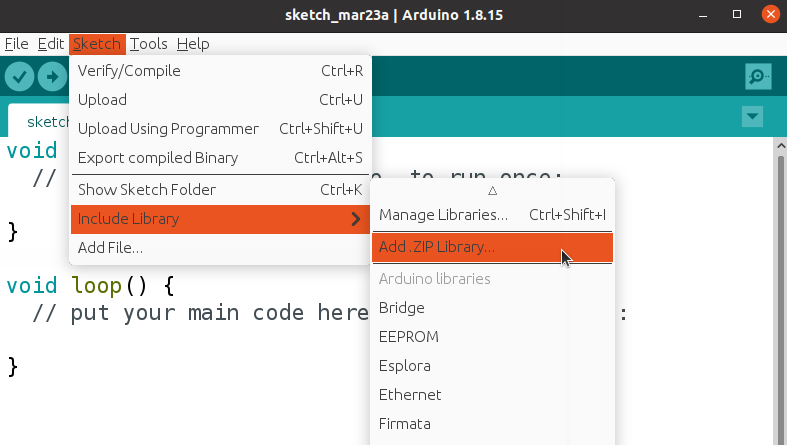

# Advance Encoder for Arduino IDE


A simple but effective library to control a rotatory encoder (mechanical or optic). 

## Features:
- Uses hardware interrupts to catch signals. 
- Debouncing to prevent false keystrokes.
- Automatic value store and changing

## How to install
First, download this repository as zip. \
Then, go to:



Click and select the zip file. That is all.

  
## API: (available functions) 

After install the library, include it with:
```
#include "AdvancedEncoder.hpp"
```
### Constructor
```
AdvancedEncoder encoder(pinA, pinB);
```
PinA and  PinB are the encoder outputs. Must be pins with hardware interrupts. For example, in Arduino Uno -> pinA = 2 and pinB = 3.

### Increments and decrements
This object provides a variable that stores a value

You can set the increment and decrement 


### To catch signals
This is the most important part!!!

Whe

