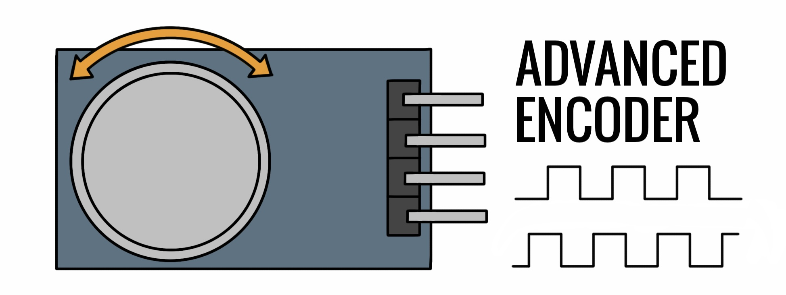

# Advanced Encoder for Arduino IDE



A simple but effective library to control a rotatory encoder (mechanical or optic). \
Suports: HW-040, optic encoders, etc. (All bidirectional encoders).

## Features:
- Uses hardware interrupts to catch signals with more reliability. 
- Debouncing to prevent false measurements.
- Automatic value store and increase/decrease without adding more code.

## How to install
First, download this repository as zip. \
Then, go to:


Click and select the zip file. That is all.

## How to use

It is so easy to use. Lets see an example. \
"We want to print ecoder value only when a user spin it. Only can take values from -15 to 40. Start in 10"

```
#include "AdvancedEncoder.hpp"

AdvancedEncoder encoder(pinA, pinB); // Create the object

void setup() {
    Serial.begin(9600);
    encoder.setValue(10); // Set a custom value
    encoder.setRange(-15, 40); // Set the range we want

    /* Imagine if we want to increment the encoder value in 2 units 
     * and decrement in 3 units.
     */
    // encoder.setIncrement(2);
    // encoder.setDecrement(3);
}

void loop() {
    
    // To print only when there was a change
    if (encoder.hasChanged()) {    
        Serial.print( encoder.value() );
    }
}

```

## How it works inside  (For inquisitives)

Encoders normally use one or two encoded discs and two sensors (A and B) oriented in such a way that the signal from each one is 90º out of phase between the two. In this way you can infer the direction of rotation and the ticks that it advances. In mechanic ones, balls are used that jump between metal contacts. In the optics, two barrier sensors and a disk with stripes that lets light through intermittently as it rotates.

This library uses hardware interrupts to catch every signal of A or B and compare both to get the direction. \
To avoid bounces or bad measurements, checks that the signal follows the sequence of HIGH and LOW that should correspond. Not all the signals that are received make sense considering the previous state. In this way we add a lot of reliability to the readings.

Every tick correctly readed increases or decreases the variable depending of direction. 


## API: (available functions) 

After install the library, include it with:
```
#include "AdvancedEncoder.hpp"
```
### Constructor
```
AdvancedEncoder encoder(pinA, pinB);
```
PinA and  PinB are the encoder outputs. Must be pins with hardware interrupts. For example, in Arduino Uno -> pinA = 2 and pinB = 3.

### Increments and decrements
This object provides a variable that stores a value

You can set the increment and decrement 


### To catch signals
This is the most important part!!!

Whe


